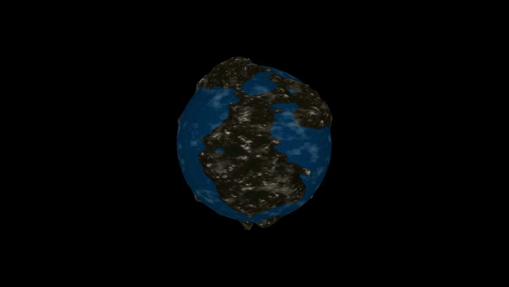

# TidalForceThreeJS

> The simulation of tidal force is the outcome of a project developed using HTML and JavaScript languages along with the THREE.js library. Its development had an evaluative purpose, mainly exploring the concepts taught in the Computer Graphics classes within the Information Technology course at UFERSA.

## :scroll: What is the project?

The project consists of simulating the effects on oceans caused by the moon's movement around planet Earth. This phenomenon is scientifically known as Tidal Force.

## :gear: Initialization and Execution

To perform the project execution on your machine, download the files from the repository, and at the project's root, execute:

```
	npx serve .
```

Now, if you want to view the results in a simpler way, just access the link below:


## :video_game: Controls

### Keyboard :keyboard:

"With the keyboard, our project allows the user to move the moon around the Earth as they please. To do this, simply press:

- :arrow_up_small: (Arrow up) To move the moon upwards along the Y and Z axes
- :arrow_down_small: (Arrow down) To move the moon downwards along the Y and Z axes.
- :arrow_backward: (Arrow left) To move the moon to the left along the X and Z axes
- :arrow_forward: (Arrow right) To move the moon to the right along the X and Z axes.

Additionally, it's possible to stop the moon's movement to get a better view of the environment. To do this, press:

- :heavy_minus_sign: (Space bar) To stop the moon's movement.

### Mouse :computer_mouse:

With the mouse, it's possible to move around the scene.

-   By pressing the left mouse button and moving the mouse, you can change the camera perspective in relation to the globe.
    
-   By pressing the right mouse button and moving the mouse, you can move the camera orthogonally in the scene.
    
-   It's also possible to zoom in and out of the scene using the scroll wheel.

## :clipboard: Details

### 3D Model

For a better visualization of the ocean's movement, it was necessary to apply relief to the object representing our globe. So, for enhanced visualization and quality, we decided to import a pre-made model created by a user on SketchFab.



Creator: [berzerkey](https://sketchfab.com/berzerkey)

## :bust_in_silhouette::bust_in_silhouette: Made by:

:man_teacher: Teacher: Me. Marco Diego Aurelio Mesquita 
:man_student: Dev: [Kennedy Alves Pereira](https://github.com/kennedyAlvess) 
:man_student: Dev: [Leonardo Inácio Guilherme Dantas](https://github.com/LeonardoIGD) 
